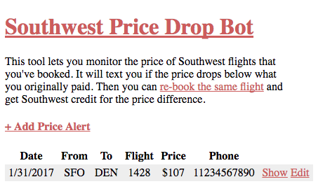
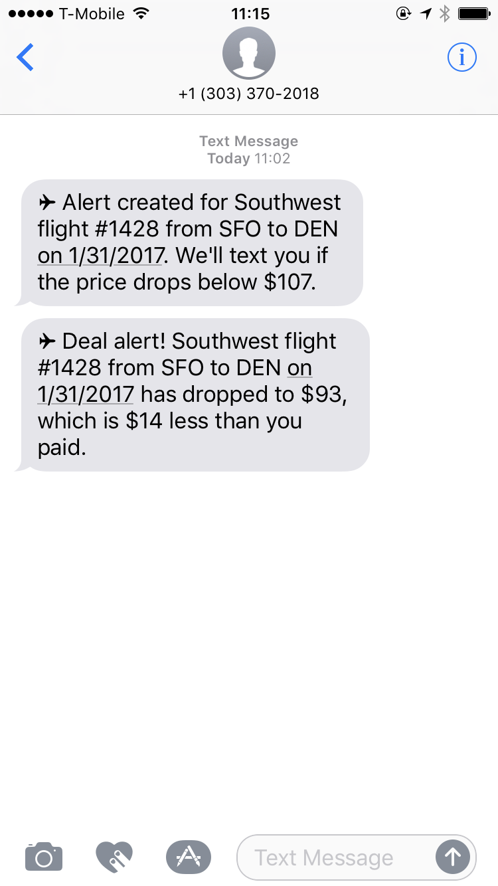

# southwest-price-drop-bot

[![deploy][deploy-image]][deploy-href]
[![dependencies][dependencies-badge]][dependencies-href]
[![dev-dependencies][dev-dependencies-badge]][dev-dependencies-href]

Bot that watches Southwest flights for price drops.

## Deployment

1. Click the `Deploy to Heroku` button above
1. Fill out the config variables and click `Deploy`
1. Open up the `Heroku Scheduler` from your app's dashboard
1. Add an hourly task that runs `node --harmony_async_await tasks/check.js`

## Screenshots

[deploy-image]: https://www.herokucdn.com/deploy/button.svg
[deploy-href]: https://heroku.com/deploy

[dependencies-badge]: https://img.shields.io/david/scott113341/southwest-price-drop-bot/master.svg?style=flat-square
[dependencies-href]: https://david-dm.org/scott113341/southwest-price-drop-bot/master#info=dependencies

[dev-dependencies-badge]: https://img.shields.io/david/dev/scott113341/southwest-price-drop-bot/master.svg?style=flat-square
[dev-dependencies-href]: https://david-dm.org/scott113341/southwest-price-drop-bot/master#info=devDependencies
